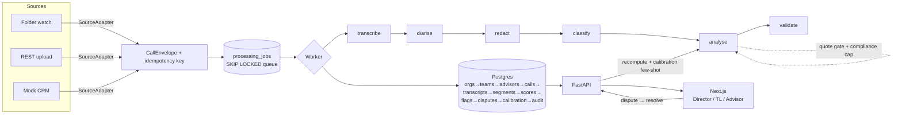

# CallSense — Sales-Call Intelligence for FitNova

Built for the FitNova brief (a Bangalore fitness & wellness coaching platform selling
personal-training programs + free trial sessions over the phone). Branded for
SkilloVilla.

Every sales call is **ingested** from any source, **transcribed + diarised**, **scored**
against a 5-dimension rubric by an LLM that must **quote its evidence**, **flagged**
for mis-selling (e.g. "weight loss guaranteed") with timestamps, stored in **Postgres**,
and surfaced on three role-specific **dashboards** (Director / Team Leader / Advisor) —
with a human **dispute loop** that recomputes scores and feeds few-shot calibration
back into the prompt. One command brings the whole thing up.

> Design docs: [`CallSense_0-1_Plan.md`](CallSense_0-1_Plan.md) ·
> [`CallSense_Concepts_Explained.md`](CallSense_Concepts_Explained.md)

---

## What works (all end-to-end, verified)

- **Source-agnostic ingestion** — folder watch, REST upload, and a mock-CRM adapter,
  all normalised into one `CallEnvelope`. ffprobe validation + `sha256(audio)+source`
  idempotency key (double delivery → one row).
- **Postgres-backed pipeline** — `SELECT … FOR UPDATE SKIP LOCKED` queue + worker,
  six idempotent stages (transcribe → diarise → redact → classify → analyse →
  validate), retries with exponential backoff + jitter, dead-lettering, and
  crash-resume via a visibility timeout.
- **Transcription + diarisation** — local `faster-whisper` (Hinglish, int8) behind a
  `Transcriber` interface; stereo channel-split diarisation with a mono turn-based
  fallback. `MockTranscriber` runs the loop with no model/network.
- **Analysis engine** — rubric scoring + issue flags via an `LLM` interface
  (Anthropic, or `MockLLM`), forced JSON + Pydantic validation, the
  **quote-verification gate** (fuzzy-match each quote to the transcript; unmatched →
  dropped), timestamps **derived** from the matched segment, confidence thresholding,
  and the **compliance cap** (a critical flag caps the composite at 40).
- **PII redaction** before the LLM ever sees text (phones, cards w/ Luhn, OTP,
  Aadhaar, email, PAN).
- **Three dashboards** (Next.js + Tailwind + Recharts) — org health, team coaching
  (leaderboard + dimension heatmap + dispute inbox), advisor detail, and the
  **call-detail page**: audio player + speaker-coloured transcript, flags pinned at
  their timestamps, click-to-seek, and Dispute.
- **Dispute loop** — advisor disputes → TL upholds/dismisses → flag state changes →
  **score recomputes** (dismissing a critical flag lifts the cap) → resolution becomes
  a `calibration_example` few-shot. Every human action hits the `audit_log`.
- **28 tests** (unit + integration + API), all green.

---

## Quickstart

### A. Docker (the intended grader path)

```bash
make demo     # builds db+api+worker+web, waits for health, seeds ~25 calls
# → Dashboard     http://localhost:3000
# → API + Swagger http://localhost:8000/docs
```

Runs entirely in `MOCK_MODE` (no API key needed). See the smoke checklist below.

### B. Local dev without Docker (Windows + conda — how this was built/verified)

Two conda envs: `callsense` (Python 3.11 backend + a conda-provided Postgres) and
`callsense-web` (Node for the frontend).

```powershell
# --- backend env (Python 3.11 + Postgres, no system installs) ---
conda create -n callsense --override-channels -c conda-forge python=3.11 postgresql pip -y
conda run -n callsense python -m pip install -r backend/requirements-dev.txt

# --- local Postgres (data dir: .pgdata, gitignored) ---
./scripts/localdb.ps1 init
./scripts/localdb.ps1 start
./scripts/localdb.ps1 createdb           # creates the callsense role + database

# --- schema + demo data ---
cd backend; conda run -n callsense alembic upgrade head; cd ..
conda run -n callsense python demo/seed.py

# --- run it ---
cd backend; conda run -n callsense python -m uvicorn app.main:app --port 8000   # API
# in another shell:
conda create -n callsense-web --override-channels -c conda-forge "nodejs>=20" -y
cd frontend; conda run -n callsense-web npm install
$env:NEXT_PUBLIC_API_URL="http://localhost:8000"; conda run -n callsense-web npm run dev
# → http://localhost:3000
```

---

## Architecture



---

## Real vs mocked

| Capability | State |
|---|---|
| Postgres schema, migrations, rollup views | **Real** |
| Ingestion adapters, ffprobe validation, idempotency | **Real** |
| Job queue (SKIP LOCKED), retries, dead-letter, resume | **Real** |
| Diarisation (stereo channel-split + mono fallback) | **Real** |
| PII redaction (regex + Luhn) | **Real** |
| Quote-verification gate, compliance cap, scoring | **Real** |
| Dashboards + call detail + audio-synced transcript | **Real** |
| Dispute → recompute → calibration → audit loop | **Real** |
| **Transcription** | Real `faster-whisper` in real mode; **`MockTranscriber`** returns a fixture transcript in `MOCK_MODE` |
| **LLM analysis** | Real Anthropic in real mode; **`MockLLM`** returns a fixture analysis in `MOCK_MODE` (keyless demo) |
| Auth/SSO | Out of scope — role switcher + API-layer stub |
| Live telephony | Out of scope — the adapter interface shows the plug-in point |

Nothing is trained. Scoring is prompting; the dispute loop feeds few-shot calibration
now and a fine-tuning set later (roadmap).

---

## Smoke checklist (what a grader does)

1. `make demo` → open **http://localhost:3000**.
2. **Director**: org score, trend, team bars, risk feed.
3. Upload a call (Director → *Ingest a call*, pick "Over-promiser — guaranteed weight
   loss") → lands on the **call detail** page.
4. Click the `over_promising` flag → audio **seeks** to the quote; note the composite
   is **capped at 40**.
5. On the flag, click **Dispute** → add a note → submit.
6. Switch role to **Team Leader** → **Dispute inbox** → **Dismiss** → the call's score
   **recomputes upward** (cap lifted) and a calibration example is minted.
7. **Advisor** view → radar vs team, my calls.

---

## Testing

```bash
cd backend && conda run -n callsense pytest       # 28 tests
```

Unit (redaction incl. Hinglish numbers + Luhn; quote gate incl. STT-noisy + absent;
compliance cap; idempotency; adapter mapping), integration (full loop writes every
table; duplicate → one call; non-sales excluded; retry→dead-letter; idempotent
resume), API (dispute lifecycle + recompute + 409 state-machine guard).

---

## Repo layout

```
callsense/
├─ docker-compose.yml  Makefile  README.md  WRITEUP.md  .env.example
├─ backend/
│  ├─ app/          FastAPI (config, main, routes/, deps, schemas)
│  ├─ ingestion/    CallEnvelope, ffprobe validation, adapters/, service
│  ├─ pipeline/     queue.py (SKIP LOCKED), worker.py, stages/
│  ├─ transcription/ Transcriber iface, faster-whisper, mock, diarize
│  ├─ analysis/     rubric, schema, verify (quote gate), redaction, llm, recompute
│  ├─ db/           models.py, views.sql, session, alembic/
│  ├─ fixtures.py   MOCK_MODE canned transcripts + analyses
│  └─ tests/        unit/ integration/ api/
├─ frontend/        Next.js app (app/, components/, lib/) + SkilloVilla logo
├─ demo/            seed.py (org/teams/advisors/calls)
└─ scripts/         localdb.ps1 (Windows conda Postgres helper)
```

---

## If I had another week

- Real-model eval harness (`make eval`) reporting flag precision/recall on golden
  transcripts.
- Live ops page polling `/ops/jobs` to watch stages tick (queue is already there).
- Cloud-STT (`Sarvam`) and local-Ollama LLM adapters A/B'd on real calls.
- Materialised rollups + refresh job past ~1M calls/quarter.
